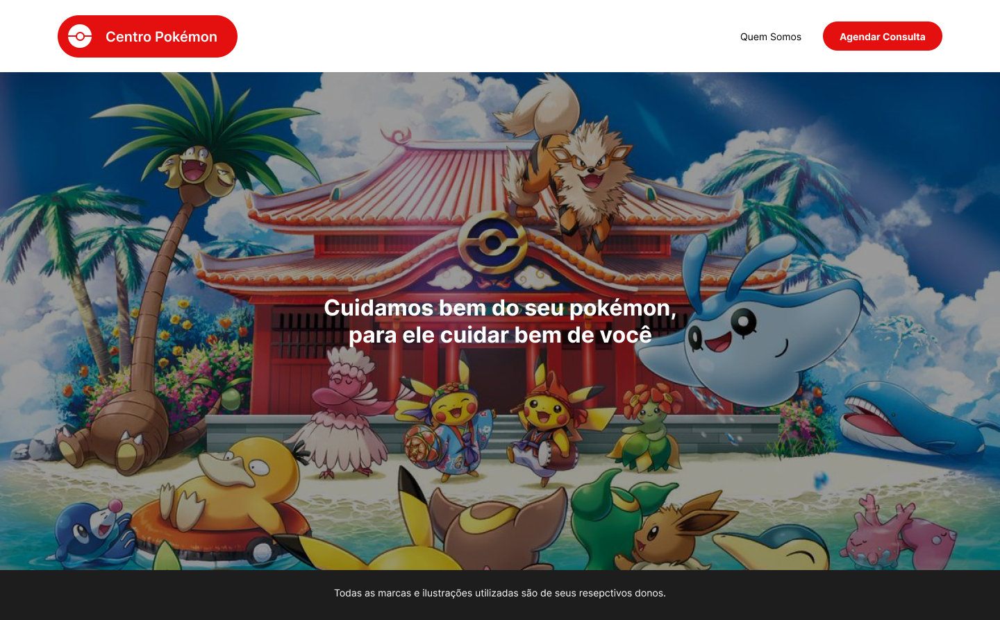

# PETZ
 
Teste técnico para desenvolvimento frontend – React/NextJS.

## Setup

Instale as dependências do código com seu gerenciador de pacotes favorito.

```shell
npm i
yarn 
```

## Inicie o projeto
```shell
npm run dev
yarn dev
```

## Objetivo

Desenvolver um web app em Typescript, a partir deste projeto nextjs (clone o repositório e desenvolva em cima dele), que implemente o design descrito na próxima seção.

### Requisitos
- Criar um código desacoplado, organizado e testável
- Escrever testes unitários com jest e react-testing-library
- Demonstrar conhecimento do uso de hooks
- Demonstrar conhecimento de modularização de componentes
- Utilizar CSS (puro, in js – styled components / emotion, como preferir) ou Sass para estilizar as páginas
- Demonstrar organização, desacoplamento e separação de responsabilidades no código; o uso de padrões arquiteturais como MVVM, CLEAN, etc., é bem-vindo
- Demonstrar conhecimento de TypeScript e suas features para organizar o projeto
- Tratar possíveis erros de API

Configurar as bibliotecas e o projeto para fazer os testes unitários também é parte do desafio.

### Diferencial
- Demonstrar conhecimentos de técnicas específicas de NextJS para lidar com estilos, server-side rendering, code splitting, etc. 

### Uso de APIs
- Usar `http://localhost:3000/api/scheduling/date` para puxar as datas disponíveis para agendamento
- Usar `htttp://localhost:3000/api/scheduling/time` para puxar os horários disponíveis para agendamento
- Usar a [pokéAPI](https://pokeapi.co/) para trazer os dados de região, cidades, e pokémons a serem usados no agendamento

Entender o contrato das APIs é também parte do teste.

### Entrega
O prazo para entrega é de **07 dias**. Responda o e-mail do teste com o link para o repositório público onde você armazenar seu código.

## Design a Ser Implementado
O site deve implementar o design descrito nas telas abaixo. Todas as imagens necessárias estão na pasta `./public/images`.

A fonte utilizada em todas as páginas, e inclusive no logo, é chamada `Inter` e está disponível no Google Fonts.

Este figma pode ser utilizado para consulta: https://www.figma.com/file/WU8hciI3zIX5RARW6nvs4i/Untitled?node-id=109%3A131&t=xBBhYvrgvf6H9On7-1

### Home

Obs: O logo deve seguir o seguinte comportamento, iniciando expandido na home, e reduzindo após 05 segundos, da direita para a esquerda. Ele deve estar na forma reduzida nas demais páginas, abrindo no hover do mouse:

### Quem Somos

### Agendar Consulta

#### Caso de Sucesso

#### Caso de Falha
